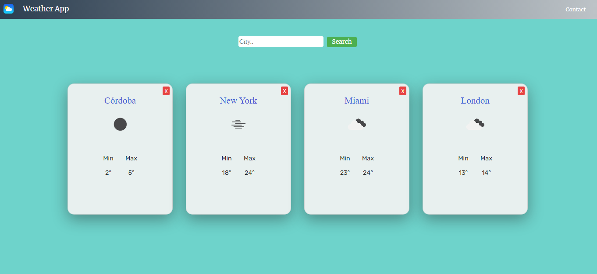

Clasica aplicacion del clima desarrollada con React Js, consumiendo una API REST que nos brinda informacion detallada de todas las ciudades del mundo. 
Esta aplicacion le permite al usuario realizar una busqueda de una ciudad y consultar informacion detallada de cada una de ellas.

